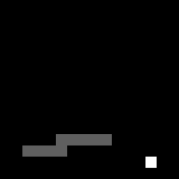

# DQN Snake Game with Tensorflow


## Environments

```
* 9th generation Intel® CoreTM processor onwards
* At least 32GB RAM
* Windows 10
* Python 3.9
* NVIDIA GTX 1660
* Tested on both Windows 11 and WSL2(Ubuntu 22.04.2 LTS Distribution)
```

## Clone code

```shell
git clone https://github.com/jangyj405/DQN_SnakeGame
```

## Prerequite

```shell
python -m venv .venv
.venv\Scripts\activate

cd DQN_SnakeGame
python -m pip install -U pip
python -m pip install -r requirements.txt
```

## Steps to run
### for test
```shell
.venv\bin\activate
cd DQN_SnakeGame
python test.py
```
### for training
```shell
.venv\bin\activate
cd DQN_SnakeGame
python main.py
```
### training model from scratch
```python
# main.py
# change the parameter 'load_model' to False to start training from scratch
brain = Brain(input_shape=input_shape, n_output=4, load_model=False, epsilon = 0.9)
```
## Trouble Shooting
```shell
OSError: Cannot parse keras metadata at path brain\keras_metadata.pb: Received error: Error parsing message
```
Manually download the model from here(https://blog.naver.com/jangyj405/223168261420), and unzip.